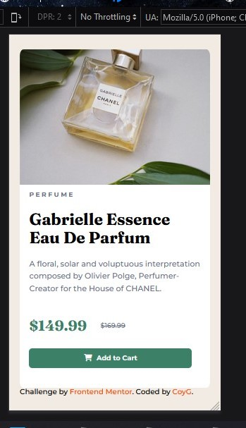
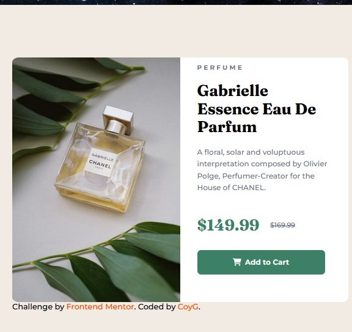

# Frontend Mentor - Product preview card component solution

This is a solution to the [Product preview card component challenge on Frontend Mentor](https://www.frontendmentor.io/challenges/product-preview-card-component-GO7UmttRfa). Frontend Mentor challenges help you improve your coding skills by building realistic projects. 

## Table of contents

- [Overview](#overview)
  - [The challenge](#the-challenge)
  - [Screenshot](#screenshot)
  - [Links](#links)
- [My process](#my-process)
  - [Built with](#built-with)
  - [What I learned](#what-i-learned)
  - [Continued development](#continued-development)
  - [Useful resources](#useful-resources)
- [Author](#author)


## Overview

I used HTML and CSS to create a replicate site as best I could.

### The challenge

Users should be able to:

- View the optimal layout depending on their device's screen size
- See hover and focus states for interactive elements

### Screenshot




### Links

- Solution URL: [GitHub](https://github.com/CoyaG/1-Product-preview-card-component.git)

## My process

I began with a basic layout of all of the main sections, using borders. I then added the photo and began dealing with text alignment, as well as other styling details. After the desktop version was done, I used media queries to create the mobile version.

### Built with

- Semantic HTML5 markup
- CSS custom properties
- Flexbox
- VS Code
- Font Awesome

### What I learned

I was able to get more familiar with media queries and played around with hiding photos under certain circumstances.

```html
 <div class="main-card">
    <div class="product-photo">
      
      
    </div>
  </div>
```
```css
#desktop{
    display: none;
  }
  #mobile{
    height: 100%;
    width: 100%;
    display: block;
  }
```

### Continued development

I am hoping to finally get a grasp on grid layouts and continue with learning JavaScript.

### Useful resources

- [Font Awesome](https://fontawesome.com/) - This was useful in creating the cart icon for the button.
- [MDN](https://developer.mozilla.org/en-US/) - This site allowed me to figure things out when I forgot something or needed help with something new.

## Author

- Frontend Mentor - [@CoyaG](https://www.frontendmentor.io/profile/CoyaG)
- Twitter - [@CoyaG1](https://twitter.com/CoyaG1)